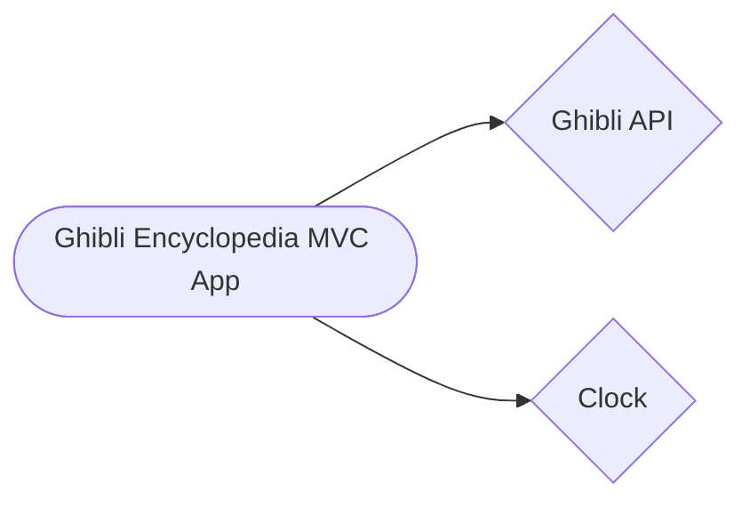

# System Architecture

## Architecture Style

Monolith (MVC App)

## Architecture Diagram

_Note: Install the [Mermaid Previewer](https://chromewebstore.google.com/detail/mermaid-previewer) to view the diagram._

## Tech Stack
- **Programming Language:** Java + Spring Boot + Angular (served bu tomcat)
- **Database:** H2

## Repository Strategy

Mono-repo repository structure
